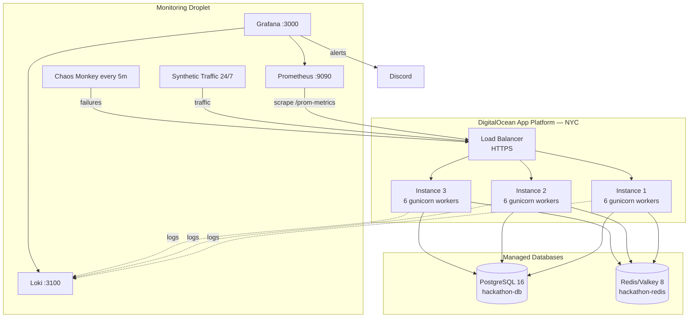

# PE Hackathon — URL Shortener

A production-grade URL shortener built for the MLH Production Engineering Hackathon. The focus is on reliability, scalability, and observability — not just functionality.

**Stack:** Flask · Gunicorn · PostgreSQL · Redis · Prometheus · Grafana · Loki · k6

https://github.com/user-attachments/assets/overview-compressed.mp4

## Architecture



**Production:** https://pe-hackathon-hni9m.ondigitalocean.app
**Staging:** https://pe-hackathon-staging-stj5i.ondigitalocean.app
**Grafana:** http://143.198.173.164:3000

## Quick Start

```bash
# Clone and install
git clone https://github.com/AustinWheel/chaos-monkey.git && cd chaos-monkey
uv sync

# Option 1: Docker (recommended) — runs app + db + redis + nginx + monitoring
docker compose up -d
# App: http://localhost:8080
# Grafana: http://localhost:3000

# Option 2: Local dev (requires local Postgres)
cp .env.example .env  # edit DB credentials
uv run python run.py
# App: http://localhost:5001
```

## Running Tests

```bash
# Unit + integration tests (132 tests, 75% coverage)
uv run pytest tests/ -v --cov=app

# E2E smoke tests against a live deployment
BASE_URL=https://pe-hackathon-hni9m.ondigitalocean.app uv run pytest tests/test_e2e_smoke.py -v

# Load tests (requires k6)
k6 run --env BASE_URL=https://pe-hackathon-hni9m.ondigitalocean.app loadtests/baseline.js  # 50 users
k6 run --env BASE_URL=https://pe-hackathon-hni9m.ondigitalocean.app loadtests/silver.js    # 200 users
k6 run --env BASE_URL=https://pe-hackathon-hni9m.ondigitalocean.app loadtests/gold.js      # 500 users
```

## CI/CD

Every push triggers the pipeline in `.github/workflows/tests.yml`:

| Trigger | What runs |
|---|---|
| PR to `main` | Tests + coverage → deploy to staging → e2e smoke tests |
| Push to `main` | Tests + coverage → deploy to production → health verification |
| Push to `staging` | Tests + coverage → deploy to staging → health verification |

Deploys are blocked if tests fail.

## API Endpoints

| Method | Path | Description |
|---|---|---|
| GET | `/health` | Health check (200 OK / 503 degraded) |
| GET | `/metrics` | System metrics (CPU, memory) |
| GET | `/prom-metrics` | Prometheus exposition format |
| GET/POST | `/users` | List / create users |
| GET/PUT | `/users/:id` | Get / update user |
| GET/POST | `/urls` | List / create short URLs |
| GET/PUT | `/urls/:id` | Get / update URL |
| GET | `/r/:code` | Redirect to original URL |
| GET/POST | `/products` | List / create products |
| GET | `/events` | List analytics events |
| GET/POST | `/alerts` | List / create alerts |
| PUT | `/alerts/:id` | Update alert status |
| GET | `/logs` | Query structured logs |
| GET | `/loadtest/results` | Load test result history |

### Chaos Engineering Endpoints

| Method | Path | Description |
|---|---|---|
| GET | `/chaos/error` | Simulate a 500 error |
| GET | `/chaos/error-flood?count=N` | Generate N errors (returns 500) |
| GET | `/chaos/cpu?duration=N&threads=N` | CPU spike |
| GET | `/chaos/latency?delay=N` | Inject latency |
| GET | `/chaos/health-fail?duration=N` | Make /health return 503 |
| GET | `/chaos/kill?delay=N` | Kill the instance process |
| GET | `/chaos/critical` | Send critical alert to Discord |

## Project Structure

```
├── app/
│   ├── __init__.py          # App factory, middleware, health endpoint
│   ├── database.py          # Pooled Postgres connection
│   ├── cache.py             # Redis caching with graceful degradation
│   ├── loki_handler.py      # Async log shipping to Loki
│   ├── models/              # Peewee ORM models
│   └── routes/              # Flask blueprints
├── monitoring/
│   ├── docker-compose.yml   # Prometheus + Grafana + Loki + Alertmanager
│   ├── prometheus.yml       # Scrape config
│   ├── cloud-init.yaml      # Droplet bootstrap
│   └── grafana/provisioning/
│       ├── dashboards/      # Overview + Logs dashboards (JSON)
│       ├── datasources/     # Prometheus + Loki
│       └── alerting/        # 9 alert rules + Discord contact point
├── loadtests/               # k6 scripts (baseline, silver, gold, stress)
├── scripts/
│   ├── synthetic_traffic.py # 24/7 traffic generation
│   ├── chaos_monkey.py      # Automated failure injection
│   └── update-monitoring.sh # Deploy monitoring changes
├── tests/                   # 132 tests (unit, integration, e2e)
├── docs/                    # Full documentation index
├── docker-compose.yml       # Local dev: 3 app instances + nginx + db + redis
├── Dockerfile               # Production image
└── .do/app.yaml             # App Platform spec
```

## Documentation

See [`docs/README.md`](docs/README.md) for the full index:

- [Deployment Guide](docs/deployment.md) — deploy, rollback, manage environments
- [Observability Guide](docs/observability/observability.md) — monitoring, metrics, logging, alerting
- [Runbook](docs/observability/runbook.md) — incident response procedures
- [Failure Modes](docs/reliability/failure-modes.md) — known failures and recovery
- [Capacity Plan](docs/scalability/capacity-plan.md) — scaling strategy and limits
- [Decision Log](docs/decisions.md) — architectural decisions
- [Verification](docs/verification.md) — quest evidence and screenshots

## Environment Variables

| Variable | Description | Default |
|---|---|---|
| `DATABASE_URL` | PostgreSQL connection string | — |
| `REDIS_URL` | Redis connection string | — (graceful degradation) |
| `FLASK_DEBUG` | Enable debug mode | `false` |
| `APP_ENVIRONMENT` | `prod` / `staging` / `dev` | `dev` |
| `LOKI_URL` | Loki push endpoint | — (disabled if unset) |

See [`.env.example`](.env.example) for the full list.
