# Quest Verification

## Reliability Engineering

### Bronze

#### `/health` endpoint
```bash
$ curl -s https://pe-hackathon-hni9m.ondigitalocean.app/health | python3 -m json.tool
{
    "database": "connected",
    "environment": "prod",
    "instance_id": "4db9e47f",
    "region": "local",
    "status": "ok",
    "uptime_seconds": 1222.5,
    "version": "0.1.0"
}
```

#### Unit tests and pytest collection
- **Test directory:** [`tests/`](../tests/) — 12 test files, 132 tests
- **Coverage:** 75% (threshold set at 70%)

```
Name                         Stmts   Miss  Cover
----------------------------------------------------------
app/__init__.py                 98     10    90%
app/models/__init__.py           6      0   100%
app/models/alert.py             13      0   100%
app/routes/alerts.py            62      3    95%
app/routes/urls.py             131     22    83%
app/routes/users.py            126     23    82%
----------------------------------------------------------
TOTAL                          878    218    75%

132 passed
```
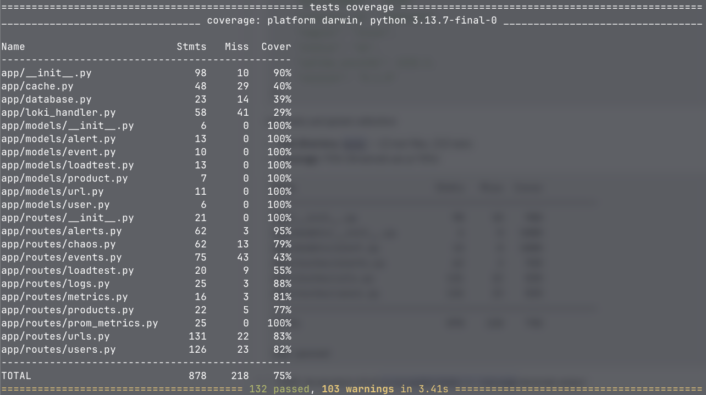
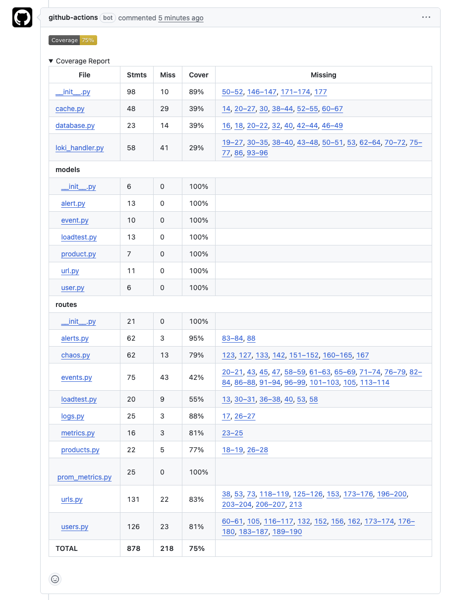

[Automatically runs on every change](https://github.com/AustinWheel/chaos-monkey/pull/9#issuecomment-4188854034)

#### CI runs tests automatically
- **Config:** [`.github/workflows/tests.yml`](../.github/workflows/tests.yml)
- CI runs on every push to `main`/`staging` and every PR to `main`

[PR Pipeline](https://github.com/AustinWheel/chaos-monkey/actions/runs/24001996659)

[Main Pipeline](https://github.com/AustinWheel/chaos-monkey/actions/runs/24001601222)
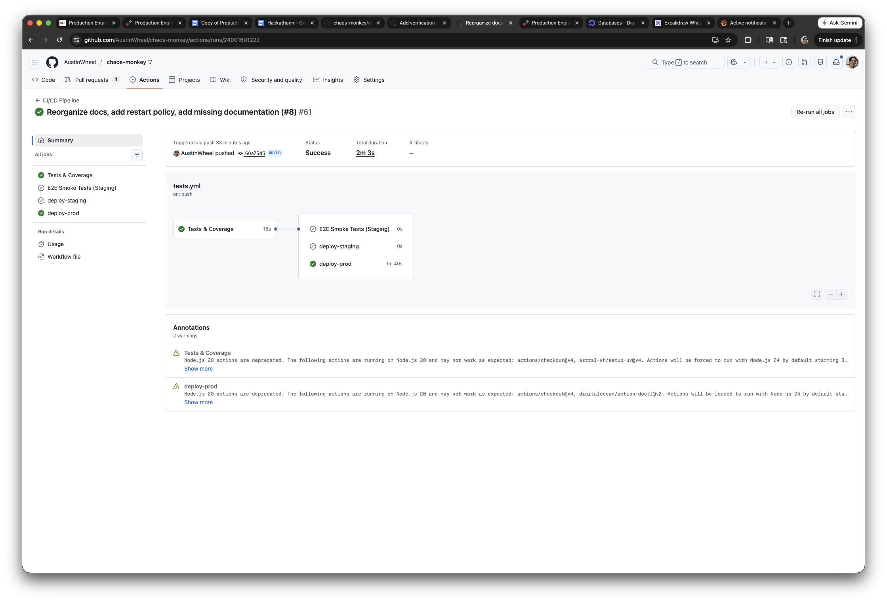
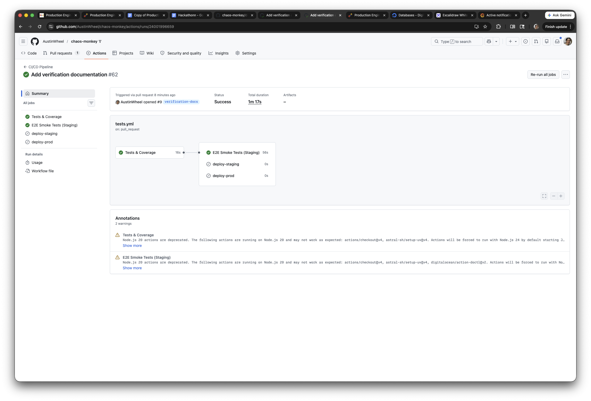

### Silver

#### 50%+ test coverage
Covered above — 75% coverage exceeds both Silver (50%) and Gold (70%) thresholds.

#### Integration/API tests
- **E2E smoke tests:** [`tests/test_e2e_smoke.py`](../tests/test_e2e_smoke.py) — 10 tests that run against live staging
- **Integration tests:** [`tests/test_urls_integration.py`](../tests/test_urls_integration.py), [`tests/test_users_integration.py`](../tests/test_users_integration.py), [`tests/test_events_integration.py`](../tests/test_events_integration.py)
- E2E tests run automatically on every PR in the `e2e-staging` CI job

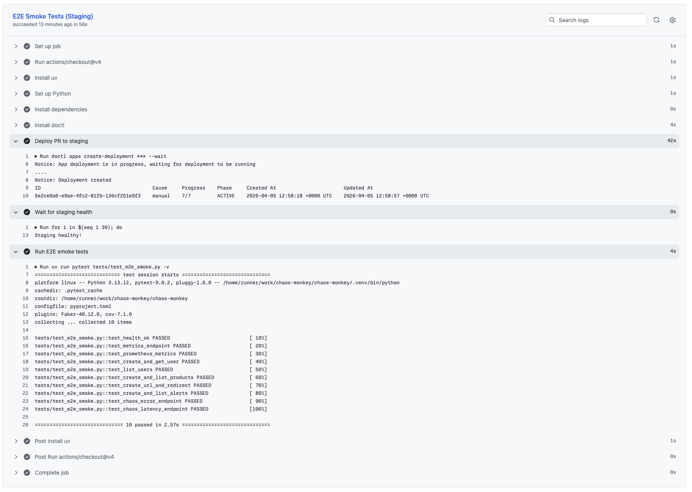

#### Error handling documented
- **Document:** [`docs/reliability/error-handling.md`](reliability/error-handling.md)
- Covers HTTP status codes 200, 201, 302, 400, 404, 410, 500, 503 with examples

### Gold

#### 70%+ test coverage
Covered above — 75%.

#### Invalid input returns clean errors

| Input | Endpoint | Response |
|---|---|---|
| Empty POST body | `POST /users` | `{"error": "Request body is required"}` |
| Non-existent user_id | `POST /urls` | `{"error": "User not found"}` |
| Non-existent ID | `GET /users/999999` | `{"error": "User not found"}` |
| Bad short code | `GET /r/nonexistent` | 404 |

Reproduce against production:
```bash
curl -s -X POST https://pe-hackathon-hni9m.ondigitalocean.app/users \
  -H "Content-Type: application/json" -d '{}' | python3 -m json.tool

curl -s https://pe-hackathon-hni9m.ondigitalocean.app/users/999999 | python3 -m json.tool
```

#### Service restart after forced failure
App Platform automatically restarts instances that fail health checks. The `/health` endpoint is polled every 10 seconds with a failure threshold of 3.

> TODO: Video — trigger `curl https://pe-hackathon-hni9m.ondigitalocean.app/chaos/health-fail`, show the App Platform dashboard restarting the instance, then show `/health` returning 200 again

Docker Compose also has `restart: always` on all app services ([`docker-compose.yml`](../docker-compose.yml)).

#### Failure modes documented
- **Document:** [`docs/reliability/failure-modes.md`](reliability/failure-modes.md)
- Covers 9 failure modes: DB failure, high error rate, app crash, bad input, slow responses, bad deploy, webhook failure, Redis failure, monitoring failure

---

## Documentation

### Bronze

#### README with setup instructions
- **Document:** [`README.md`](../README.md)
- Includes prerequisites, quick start (6 steps), project structure, and how to add models/routes

#### Architecture diagram
- **Document:** [`docs/README.md`](README.md#architecture)
- Mermaid diagram showing App Platform, managed databases, monitoring droplet, CI/CD pipeline

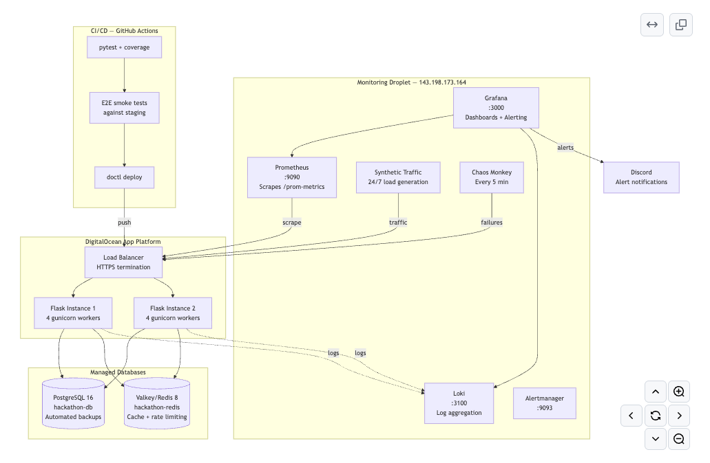

#### API endpoints documented
- **Document:** [`docs/README.md`](README.md#api-endpoints)
- Full table of 20+ endpoints with methods and descriptions

### Silver

#### Deployment and rollback steps
- **Document:** [`docs/deployment.md`](deployment.md)
- Covers automated CI/CD, manual deployment via `doctl`, rollback procedures

#### Troubleshooting steps
- **Document:** [`docs/observability/runbook.md`](observability/runbook.md)
- Step-by-step troubleshooting for each alert type (Service Down, High Error Rate, High Latency, High CPU/Memory)

#### Environment variables listed
- **Document:** [`docs/README.md`](README.md#environment-variables)
- Table of all env vars with descriptions and defaults

### Gold

#### Operational runbook
- **Document:** [`docs/observability/runbook.md`](observability/runbook.md)
- Includes quick access links, per-alert diagnosis + recovery steps, chaos monkey management, escalation procedures

#### Technical decisions documented
- **Document:** [`docs/decisions.md`](decisions.md)
- 8 architectural decision records: App Platform vs droplets, managed DBs, separate monitoring, Grafana alerting, Redis caching, single region, structured logging, k6 vs Locust

#### Capacity assumptions documented
- **Document:** [`docs/scalability/capacity-plan.md`](scalability/capacity-plan.md)
- Current config, measured performance by tier, scaling strategy (vertical + horizontal), projected limits, cost analysis

---

## Scalability Engineering

### Bronze

#### k6 configured
- **Scripts:** [`loadtests/`](../loadtests/) — `baseline.js` (50 users), `silver.js` (200 users), `gold.js` (500 users)

#### 50 concurrent users evidence
```bash
k6 run --env BASE_URL=https://pe-hackathon-hni9m.ondigitalocean.app loadtests/baseline.js
```

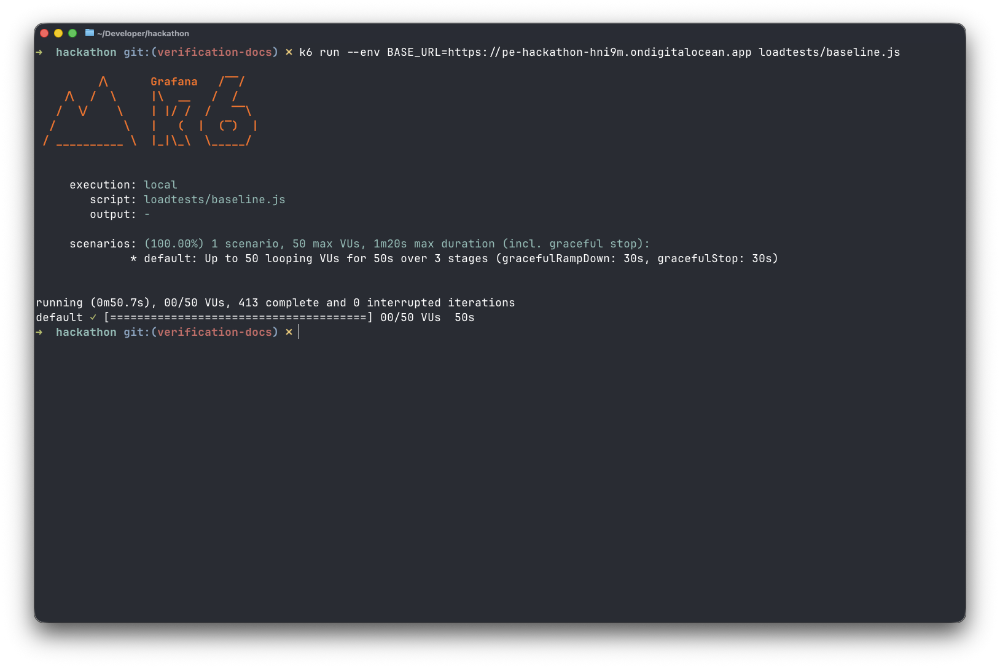

#### Baseline p95 documented
- **Document:** [`docs/scalability/load-test-baseline.md`](scalability/load-test-baseline.md)

### Silver

#### 200 concurrent users
```bash
k6 run --env BASE_URL=https://pe-hackathon-hni9m.ondigitalocean.app loadtests/silver.js
```


#### Multiple app instances in Docker Compose
- **Config:** [`docker-compose.yml`](../docker-compose.yml) — 3 app instances (`app1`, `app2`, `app3`) each with `restart: always`

#### Load balancer configuration
- **Config:** [`nginx/nginx.conf`](../nginx/nginx.conf) — Nginx upstream distributing across 3 app instances
- Production uses App Platform's built-in load balancer across 2 instances

#### Response times under 3s at scale
Shown in silver k6 output — threshold is `http_req_duration: ["p(95)<3000"]`

### Gold

#### Tsunami-level throughput (500 users)
```bash
k6 run --env BASE_URL=https://pe-hackathon-hni9m.ondigitalocean.app loadtests/gold.js
```
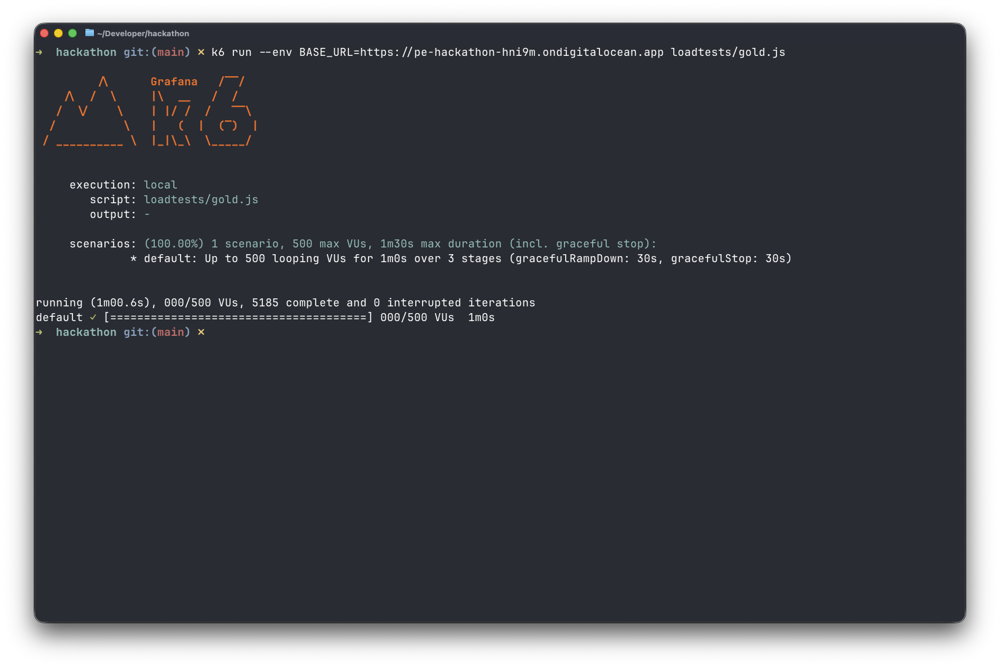

#### Redis caching implementation
- **Cache layer:** [`app/cache.py`](../app/cache.py) — `cache_get()`, `cache_set()`, `cache_delete_pattern()` with graceful degradation
- **Routes using cache:**
  - [`app/routes/products.py`](../app/routes/products.py) — 60s TTL
  - [`app/routes/users.py`](../app/routes/users.py) — 30s TTL
  - [`app/routes/urls.py`](../app/routes/urls.py) — 30s TTL

#### Bottleneck analysis
- **Document:** [`docs/scalability/bottleneck-report.md`](scalability/bottleneck-report.md)
- Identified bottlenecks: single-threaded server, no caching, unpaginated queries
- Fixes: multi-worker gunicorn, 3 instances + nginx, Redis caching
- Result: 101 req/s (single) → 330 req/s (optimized)

#### Error rate below 5%
Shown in gold k6 output — threshold is `errors: ["rate<0.05"]`

---

## Incident Response

### Bronze

#### JSON structured logging
Logs are structured JSON with `timestamp`, `level`, `message`, `instance_id`, `environment`, and request context fields.

Example log entry:
```json
{
  "timestamp": "2026-04-05 11:41:05,402",
  "level": "INFO",
  "name": "app",
  "message": "Request completed",
  "method": "GET",
  "path": "/health",
  "status": 200,
  "instance_id": "cd4476f5",
  "environment": "prod"
}
```
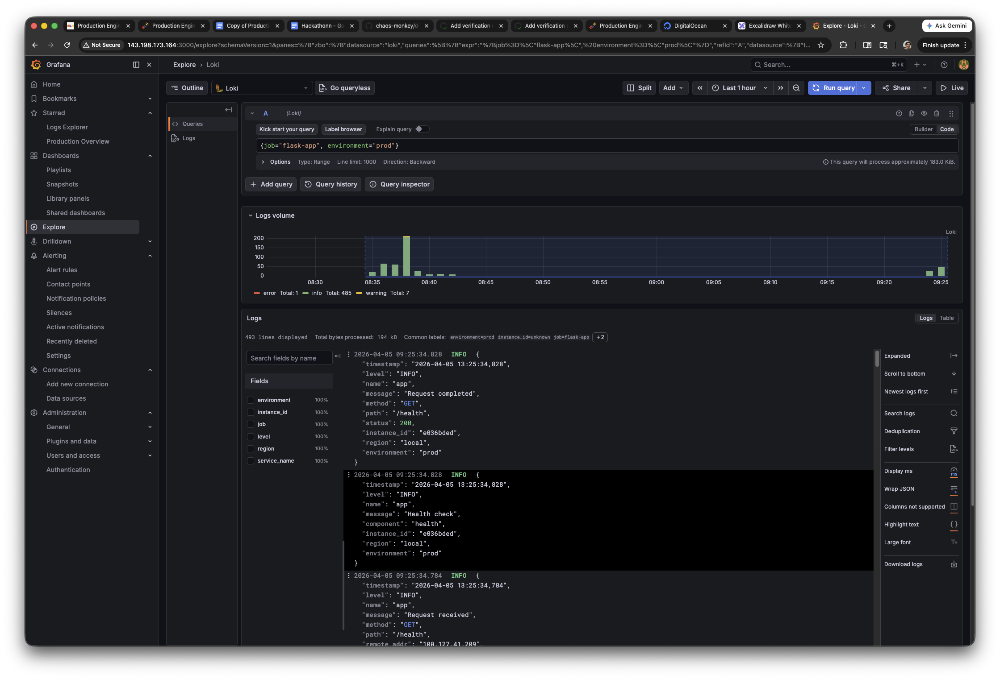
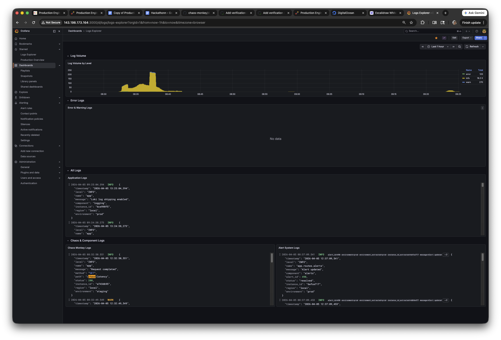

#### `/metrics` endpoint
```bash
$ curl -s https://pe-hackathon-hni9m.ondigitalocean.app/metrics | python3 -m json.tool
{
    "cpu_percent": 0.0,
    "memory_percent": 19.6,
    "memory_total_mb": 2048.0,
    "memory_used_mb": 400.9
}
```

Prometheus metrics also exposed at `/prom-metrics` with counters, histograms, and gauges for HTTP requests, latency, errors, and system resources.

#### Logs without SSH
- **Grafana Logs Explorer:** http://143.198.173.164:3000/d/logs/
- Powered by Loki — all app logs are shipped via HTTP push from the Flask app
- Queryable by level, component, environment without any SSH access

### Silver

#### Alert rules configured
9 alert rules defined in [`monitoring/grafana/provisioning/alerting/rules.yml`](../monitoring/grafana/provisioning/alerting/rules.yml):

| Alert | Condition | Severity |
|---|---|---|
| Service Down — Prod | `app_up < 1` for 1m | Critical |
| Service Down — Staging | `app_up < 1` for 1m | Warning |
| High Error Rate | Error rate > 10% for 30s | Warning |
| Critical Error Rate | Error rate > 25% for 30s | Critical |
| High P95 Latency | p95 > 2s for 2m | Warning |
| Extreme P99 Latency | p99 > 5s for 2m | Critical |
| High CPU | CPU > 80% for 2m | Warning |
| High Memory | Memory > 85% for 2m | Warning |
| High Saturation | In-flight > 50 for 1m | Warning |

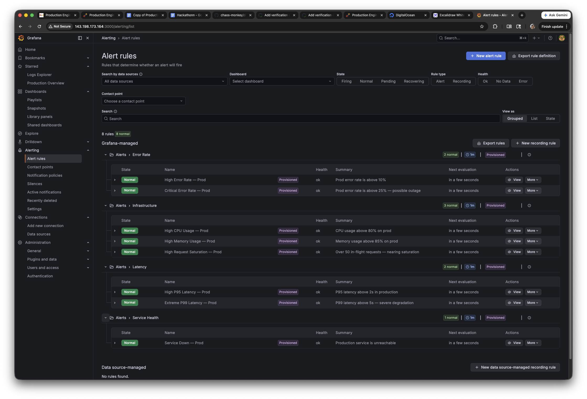

#### Alerts routed to Discord
- **Contact point config:** [`monitoring/grafana/provisioning/alerting/contactpoints.yml`](../monitoring/grafana/provisioning/alerting/contactpoints.yml)
- Discord webhook receives all alerts with severity, summary, and dashboard links
- Can test with: `curl https://pe-hackathon-hni9m.ondigitalocean.app/chaos/critical`

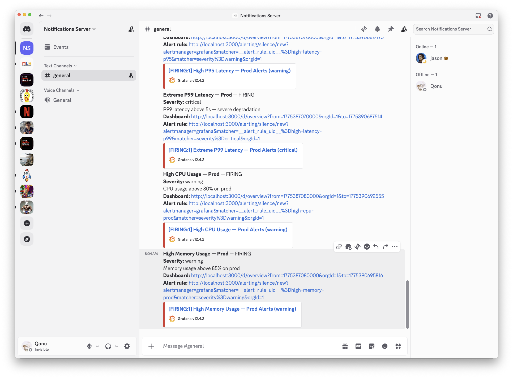

#### Alerting latency under 5 minutes
- Grafana evaluates alert rules every **1 minute**
- `for` thresholds range from **30 seconds** (error rate) to **2 minutes** (latency/CPU)
- Discord notification fires within seconds of state change
- **Total time from failure to notification: under 3 minutes**

### Gold

#### Dashboard covers 4 golden signals
- **Dashboard:** http://143.198.173.164:3000/d/overview/
- **Latency:** P50/P95/P99 percentiles, per-endpoint breakdown
- **Traffic:** Request rate (RPS), by endpoint, by status code
- **Errors:** Error rate %, 5xx by endpoint, 4xx/5xx breakdown
- **Saturation:** CPU, memory, in-flight requests, file descriptors

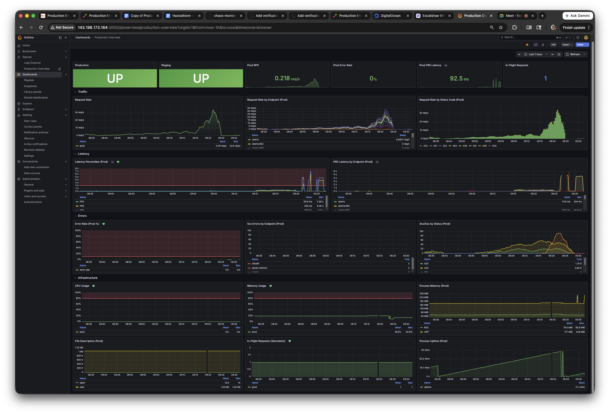

#### Runbook with alert-response procedures
- **Document:** [`docs/observability/runbook.md`](observability/runbook.md)
- Per-alert sections with Diagnose → Recover steps, copy-paste commands

#### Root-cause analysis of simulated incident

> TODO: Trigger a chaos event (e.g. `curl .../chaos/error-flood?count=100`), then document the diagnosis process:
> 1. Alert fires in Discord — screenshot
> 2. Open Grafana dashboard — screenshot showing error rate spike
> 3. Click through to Loki logs — screenshot showing the chaos error entries
> 4. Identify root cause from log component field (`component: "chaos"`)
> 5. Resolve: errors are transient from chaos monkey, no action needed
> 6. Show error rate returning to normal — screenshot

---

## Remaining TODOs

| Item | Action |
|---|---|
| Service restart video | Video: trigger health-fail, show App Platform restart, show recovery |
| Root-cause analysis | Walk through a chaos incident with screenshots (see steps above) |
